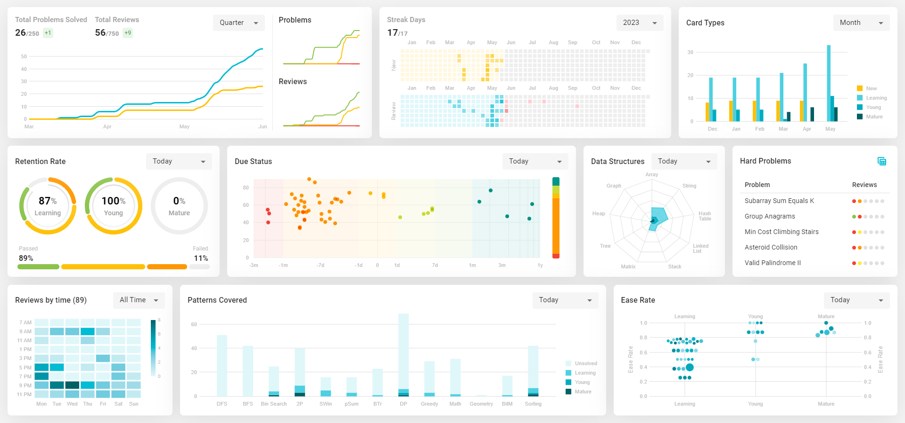

# Leetcode Dashboard



## Development

- Download and install Anki
- Install [anki-connect](https://ankiweb.net/shared/info/2055492159) add-on.
- In Anki, go to `Tools` > `Add-ons` > Select `AnkiConnect` > `Config`. Update the config to allow CORS.

```json
{
  "webCorsOriginList": [
    "http://localhost:5173",
    "http://localhost:3000",
    "https://leetcode-dashboard.vercel.app"
  ]
}
```

- Do not close Anki to maintain the connection with AnkiConnect.
- Clone this repo.
- Install depedencies and run the dev server

```bash
yarn
yarn dev
```

<!--
--UI

https://dribbble.com/shots/20325736-Sales-Components


--Features

TODO:
- parse lintcode problem

Factor:
- Number of problems
- Number of reviews
- Difficulty (Easy, Medium, Hard)
- Pattern (DP, BFS, DFS, etc.)
- Due status (due, near due, not due)
- Card type (new, learning, review, young, mature)
- Ease rate (total score of Again, Hard, Good, Easy)
- Retention rate

Data Structures (Sorted by most common in interviews)
- Array
- String
- Hash Table
- Linked List
- Stack
- Matrix
- Tree
  - Binary Tree
  - Trie
- Heap
- Graph
  - Advanced Graph

Algorithm (Sorted by most common in interviews)
- DFS
- BFS
- Binary Search
- Two pointers
- Sliding window
- Prefix Sum
- Backtracking
- DP
 - DP 2D
- Greedy
- Intervals
- Math & Geometry
- Bit Manipulation
- Sorting

- Drawer
  - Problem List
  + Problem Detail

All Charts
- Highlight nodes today, this week, this month
- Click on data point that contains multiple problems
  - Show list of problems
    - See problem detail
- Click on data point that contains a single problem
  - See problem detail
+ Scatterplot - Swarmplot sync data point

LC solved over time
+ Line chart
+ Filter
  + Date: week, month, quarter, year, all
+ Summary: Total solved (increase this week), Total reviews (increase this week)
+ X: time
+ Y: number of LC solved
+ Tooltip
  - Synchronized tooltip on 2 smaller charts
- Lines:
  + Difficulty (Easy, Medium, Hard)
  * Estimated deadlines https://nivo.rocks/storybook/?path=/story/line--highlighting-negative-values

Card type over time
+ Bar
+ X: time
+ Y: Number of card type in stack (new, learning, review)
+ Filter
+ Tooltip

Review Result (Ease rate)
+ SwarmPlot
+ X: card types
+ Y: ease rate
- Hover on each dot to highlight preview reviews, future deadlines on calendar chart

Revision History
+ Calendar
+ Each cell represents a day
+ Color shade: number of LC solved
+ 2 charts: new problems and reviews
+ Tooltip: number of LC solved
+ Streak days stats
  - Tooltip to explain total number
+ Add due date as red square in the future

Hard problems Table
+ Click to see full table
+ Display upcoming leetcode problems

Heatmap
+ Show correlation between number of reviews and review hours
+ Add title
+ Add date filter
+ Add tooltip

ScatterPlot
+ Due Status
+ Dot color: Due status
+ X: Due date distance
+ Y: AC Rate
+ Filter
+ Tooltip
+ Status bar
+ Status bar tooltip

Current retention rate: In progress circle
+ 3 Circles in different states: Review, Young, Mature
+ 1 Progress bar to show overall retention rate
+ Filter
+ Tooltip

Patterns covered
+ Stacked bar chart
+ X: pattern
+ Stack item: Card type
+ Y: Number of reviews
+ Color: card type (new, learning, review)
+ Tooltip

 -->
